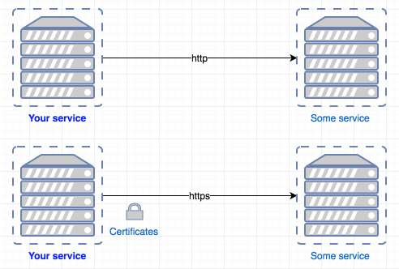
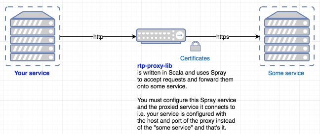

RTP Proxy Library
=================

Scala Spray library to proxy request/response between client and server

Application built with the following (main) technologies:

- Scala

- SBT

- Akka

- Spray

Introduction
------------


You want to call another service either securely or not, but you've been told you cannot do this directly - you need a proxy in the middle.

rtp-proxy-lib acts as either a proxy - it could be a dumb proxy or maybe one that makes SSL connections.

Let's take the example of communicating with another service over SSL.



Application
-----------
This module is configured as per any Akka application, where the default configuration file is "application.conf".
This default file can be overridden with other "conf" files or system properties and then given to the application upon boot with the following example Java option:
```bash
-Dconfig.file=test-classes/application.test.conf
```

Individual configuration properties can be overridden again by Java options e.g. to override which Mongodb to connect e.g.:
```bash
-Dmy.foo=blah
```

where this overrides the default in application.conf.

Booting the application (uk.gov.homeoffice.rtp.proxy.Boot) exposes a RESTful API to act as a proxy to the real API e.g. the following URL could be given in a browser, a browser's REST client plugin or curl:
```bash
http://localhost:9300/blah
```

this would get back some appropriate response for some existing API.

Build and Deploy
----------------
The project is built with SBT. On a Mac (sorry everyone else) do:
```bash
brew install sbt
```

It is also a good idea to install Typesafe Activator (which sits on top of SBT) for when you need to create new projects - it also has some SBT extras, so running an application with Activator instead of SBT can be useful. On Mac do:
```bash
brew install typesafe-activator
```

To compile:
```bash
sbt compile
```

or
```bash
activator compile
```

To run the specs:
```bash
sbt test
```

To actually run the application, first "assemble" it:
```bash
sbt assembly
```

This packages up an executable JAR - Note that "assembly" will first compile and test.

Then just run as any executable JAR, with any extra Java options for overriding configurations.

For example, to use a config file (other than the default application.conf) which is located on the file system (in this case in the boot directory)
```bash
java -Dconfig.file=test-classes/my-application.conf -jar <jar name>.jar
```

Note that the log configuration file could also be included e.g.
```bash
-Dlogback.configurationFile=path/to/my-logback.xml
```

And other examples:

booting from project root:
```bash
java -Dspray.can.server.port=8080 -jar target/scala-2.11/<jar name>.jar
```

and running from directory of the executable JAR using a config that is within said JAR:
```bash
java -Dconfig.resource=application.uat.conf -jar <jar name>.jar
```

Finally you can perform a quick test of the application by calling one of the monitor API e.g. making a cURL call to the application:
```bash
curl http://localhost:9300/proxy-server 
```

Example Usage
-------------
Proxying can be just a dumb proxy or it can use certificates to create a SSL connection.
There are examples in the code e.g. regarding SSL the application configuration would be similar to:
```scala
spray {
  can {
    server {
      name = "your-service-spray-can"
      host = "0.0.0.0"
      port = 9300
      request-timeout = 5 minutes
      idle-timeout = 10 minutes
      service = "http-routing-service"
      remote-address-header = on
      ssl-tracing = on
    }

    client {
      ssl-tracing = on
      request-timeout = 5 minutes
    }
  }
}

proxied {
  server {
    host = "localhost"
    port = 8443
  }  
}

ssl {
  keystore {
    type = "jks"
    path = "classpath:test.keystore"
    password = "password"
  }

  truststore {
    type = "jks"
    path = "classpath:test.keystore"
    password = "password"
  }
}
```
The "proxied.server" is the host and port of the service that you would normally connected to, but now that service will be proxied.
If the proxy is to make SSL connections to "some service" then you must configure where this proxy will acquire the necessary certificates and you must "boot" the proxy using SSLProxying instead of the default Proxying.

And a "boot" object would be required for your proxy such as:
```scala
object ExampleBootSSL extends App {
  val config = ConfigFactory.load("application.example.ssl.conf")

  val proxiedServer = ProxiedServer(config.getString("proxied.server.host"), config.getInt("proxied.server.port"))

  val server = Server(config.getString("spray.can.server.host"), config.getInt("spray.can.server.port"))

  implicit val system = ActorSystem("rtp-proxy-ssl-example-spray-can", config)

  sys.addShutdownHook {
    system.terminate()
  }

  SSLProxying(sslContext(config)).proxy(proxiedServer, server)
}
```

We can cURL the application (assuming that some service is being proxied) e.g.
```bash
curl -ki http://localhost:9300
```
where -k command line argument turns off SSL certificate verification.

Or where the certificate is passed along with the cURL command so a complete SSL certificate verification takes place:
```bash
curl -i --cacert src/main/resources/test-certificate.crt https://localhost:9300
```

Note, that there is a built in health endpoint for the proxy itself:
```
curl -ki http://localhost:9300/proxy-server
```

NOTE about timeouts.
Timeout of requests defaults to 30 seconds. To override this in an application.conf, declare something like:
````
proxied.request-timeout = 1 minute
```

where you can use the likes of second, seconds, minute, minutes, hour etc.

SSL
---
Generate x509 certificate and private key:
```bash
openssl req 
        -x509 
        -sha256 
        -newkey rsa:2048 
        -keyout test-certificate.key 
        -out test-certificate.crt 
        -days 100000 
        -nodes
```

On JVM platform the goal is to have a Java keystore (JKS), a repository of security certificates.
To import our newly generated certificate into JKS, we have to export it in PKCS12 format and then create keystore out of it:
```bash
openssl pkcs12 
        -export 
        -in test-certificate.crt 
        -inkey test-certificate.key 
        -out test-keystore.p12 
        -name test-keystore 
        -password pass:password

keytool -importkeystore 
        -srcstorepass password 
        -destkeystore test.keystore 
        -deststorepass password 
        -srckeystore test-keystore.p12 
        -srcstoretype PKCS12 
        -alias test-keystore
```